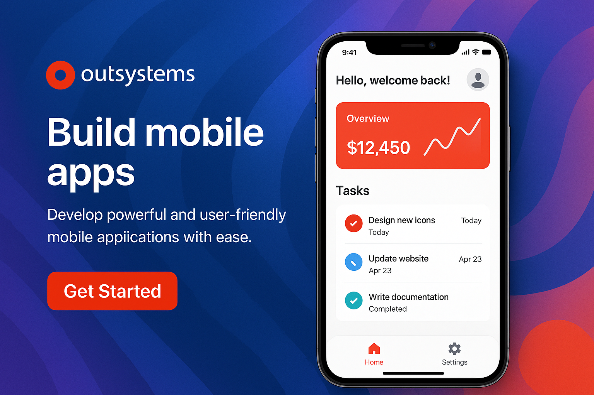

# 📱 DIOGerenciamento – Aplicativo Mobile com OutSystems

Este projeto foi desenvolvido como parte do Desafio de Projeto da **DIO**, com o objetivo de criar uma **aplicação mobile moderna, funcional e intuitiva**, utilizando a plataforma **OutSystems**. A proposta é oferecer uma experiência fluida para o usuário, com integração em tempo real, navegação clara e funcionalidades voltadas à produtividade pessoal.

## ✨ Visão Geral

O **DIOGerenciamento** é um aplicativo pensado para facilitar a organização de atividades diárias, oferecendo uma interface amigável, responsiva e adaptada a dispositivos móveis. A aplicação utiliza dados do usuário autenticado e apresenta funcionalidades personalizadas com foco na experiência do usuário.

## 🔧 Funcionalidades

- **Login com Autenticação de Usuário**
  - Integração com tabela de usuários já existente.
  - Personalização da navegação conforme perfil logado.

- **Dashboard com Atividades do Dia**
  - Exibição de tarefas e compromissos por data.
  - Marcação de tarefas como concluídas.

- **Adição e Edição de Atividades**
  - Interface rápida e prática para inclusão de tarefas.
  - Formulário com campos de data, descrição e prioridade.

- **Experiência Mobile Aprimorada**
  - Navegação por abas e botões com feedback tátil.
  - Layout adaptado a smartphones Android e iOS.

- **Reaproveitamento de Módulos e Entidades**
  - Importação de dependências entre módulos.
  - Acesso às tabelas já existentes no sistema para reutilização eficiente de dados.

## 🧪 Testes e Debug

O projeto pode ser testado em:
- **Simulador de celular no navegador** (via OutSystems)
- **Instalação direta no smartphone via cabo USB**

Ambas as opções permitem depuração em tempo real e validação da experiência do usuário em contexto real de uso.

## 🚀 Publicação

A aplicação pode ser configurada para publicação nas lojas:
- **Google Play** (.apk)
- **App Store** (.ipa)

O processo exige certificados válidos e configuração de licenças no OutSystems Service Center.

## 📁 Entrega

- Arquivo `.OML` exportado do OutSystems.
- Link para o repositório GitHub com:
  - Este README
  - Recursos complementares
  - Prints da interface ou vídeo demonstrativo

## 🔗 Links Úteis

- [Documentação oficial do OutSystems – Mobile Apps](https://success.outsystems.com/documentation/11/delivering_mobile_apps/)

---

Este projeto representa não apenas domínio técnico da plataforma, mas também sensibilidade para criar **aplicações centradas no usuário** com alto valor prático. Uma demonstração de como a tecnologia pode, de forma simples, facilitar o cotidiano.

## 📋 Descrição

O DIOGerenciamento é um aplicativo mobile desenvolvido com a plataforma OutSystems, focado em auxiliar na organização de atividades diárias. Ele oferece funcionalidades como autenticação de usuário, um dashboard intuitivo para visualização de tarefas, e a capacidade de adicionar e editar atividades de forma prática. O design é responsivo, adaptado para dispositivos Android e iOS, garantindo uma experiência de usuário aprimorada.

## 📦 Instalação

Para instalar e testar o aplicativo, siga os passos:
1. Clone este repositório para sua máquina local.
2. Abra o arquivo `.OML` exportado do OutSystems na sua IDE OutSystems (Service Studio).
3. Publique o aplicativo para o seu ambiente OutSystems.
4. Para testes em dispositivo móvel, utilize o simulador de celular no navegador ou instale diretamente via cabo USB no seu smartphone.

## 💻 Uso

Após a instalação e publicação, acesse o aplicativo em seu dispositivo móvel. Realize o login com suas credenciais. No dashboard, você poderá visualizar suas atividades diárias, marcar tarefas como concluídas e adicionar novas atividades através do formulário intuitivo. Explore as funcionalidades de edição para gerenciar seus compromissos de forma eficiente.

## 📄 Licença

Este projeto está licenciado sob a licença MIT. Veja o arquivo `LICENSE` para mais detalhes.

---

# 📱 DIOGerenciamento – Mobile Application with OutSystems

This project was developed as part of the **DIO** Project Challenge, with the aim of creating a **modern, functional, and intuitive mobile application** using the **OutSystems** platform. The proposal is to offer a fluid user experience, with real-time integration, clear navigation, and functionalities focused on personal productivity.

## ✨ Overview

**DIOGerenciamento** is an application designed to facilitate the organization of daily activities, offering a friendly, responsive interface adapted to mobile devices. The application uses authenticated user data and presents personalized functionalities with a focus on user experience.

## 🔧 Features

- **Login with User Authentication**
  - Integration with an existing user table.
  - Navigation customization according to the logged-in profile.

- **Dashboard with Daily Activities**
  - Display of tasks and appointments by date.
  - Marking tasks as completed.

- **Adding and Editing Activities**
  - Quick and practical interface for including tasks.
  - Form with date, description, and priority fields.

- **Enhanced Mobile Experience**
  - Tabbed navigation and buttons with haptic feedback.
  - Layout adapted for Android and iOS smartphones.

- **Module and Entity Reuse**
  - Import dependencies between modules.
  - Access to existing system tables for efficient data reuse.

## 🧪 Testing and Debugging

The project can be tested in:
- **Mobile simulator in the browser** (via OutSystems)
- **Direct installation on the smartphone via USB cable**

Both options allow real-time debugging and validation of the user experience in a real usage context.

## 🚀 Publication

The application can be configured for publication in the stores:
- **Google Play** (.apk)
- **App Store** (.ipa)

The process requires valid certificates and license configuration in the OutSystems Service Center.

## 📁 Delivery

- `.OML` file exported from OutSystems.
- Link to the GitHub repository with:
  - This README
  - Complementary resources
  - Interface prints or demonstrative video

## 🔗 Useful Links

- [Official OutSystems Documentation – Mobile Apps](https://success.outsystems.com/documentation/11/delivering_mobile_apps/)

---

This project represents not only technical mastery of the platform but also sensitivity to create **user-centric applications** with high practical value. A demonstration of how technology can, in a simple way, facilitate daily life.

## 📋 Description

DIOGerenciamento is a mobile application developed with the OutSystems platform, focused on assisting with daily activity organization. It offers functionalities such as user authentication, an intuitive dashboard for task visualization, and the ability to add and edit activities practically. The design is responsive, adapted for Android and iOS devices, ensuring an enhanced user experience.

## 📦 Installation

To install and test the application, follow these steps:
1. Clone this repository to your local machine.
2. Open the exported `.OML` file from OutSystems in your OutSystems IDE (Service Studio).
3. Publish the application to your OutSystems environment.
4. For mobile device testing, use the mobile simulator in the browser or install directly via USB cable on your smartphone.

## 💻 Usage

After installation and publication, access the application on your mobile device. Log in with your credentials. On the dashboard, you can view your daily activities, mark tasks as complete, and add new activities through the intuitive form. Explore the editing functionalities to manage your commitments efficiently.

## 📄 License

This project is licensed under the MIT License. See the `LICENSE` file for more details.

